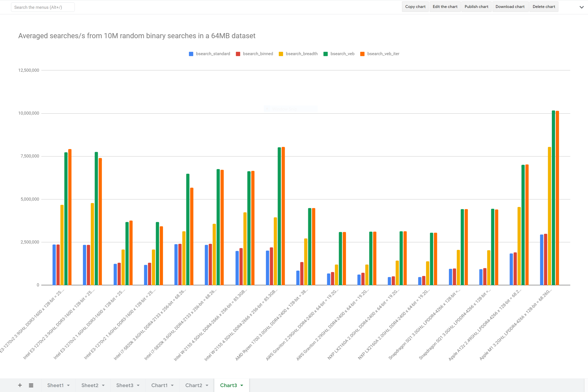

Description
-----------

This project benchmarks several implementations of binary search over a dense array of PODs:

* bsearch_standard - vanilla binary search
* bsearch_binned   - binary search with binning info prepended to the array -- saves first few iterations of the binary search
* bsearch_breadth  - breadth-first (tree-like) layout of the array
* bsearch_veb      - [Van Emde Boas](https://en.wikipedia.org/wiki/Van_Emde_Boas_tree), recursive version
* bsearch_veb_iter - Van Emde Boas, iterative version

How to Build
------------

The build script recognizes these options:

```
$ ./build_test_bsearch.sh 
usage: ./build_test_bsearch.sh { gcc | clang | debug }
```

* gcc   - use the system-default g++ compiler to build a release binary
* clang - use the system-default clang++ compiler to build a release binary
* debug - use the system-default clang++ compiler to build a debug binary

How to benchmark
----------------

The benchmark tool recognizes these options:
```
$ ./test_bsearch --help
usage: ./test_bsearch [space_size <unsigned>] [alt <unsigned>] [<sample_size>]
        alt 0: standard binary search (default)
        alt 1: binned binary search
        alt 2: breadth-first layout binary search
        alt 3: Van Emde Boas (VEB) layout binary search, recursive version
        alt 4: VEB layout binary search, iterative version
        alt 5: standard linear search
        alt 6: binned linear search
```

The POD of the search space is hardcoded to `float` -- to build for another POD change `searchitem_t` in test_bsearch.cpp. The default search-set size (`sample_size`) is set to 10M; the default search-space size (`space_size`) is 2K. To benchmark the performance of standard binary search over a search-space size of 2^24 and a search-set size of 10M do:

```
$ ./test_bsearch space_size $(echo "2^24" | bc) alt 0
```

Warning: don't run any of the linear searches (`alt` 5 & 6) on large seach spaces unless you have unlimited machine time and patience.

Results
-------

Averaged searches/second from 10M random binary searches in a 64MB dataset -- see graph below

| CPU (single thread only)                                                     | bsearch_standard | bsearch_binned   | bsearch_breadth  | bsearch_veb      | bsearch_veb_iter |
| :--------------------------------------------------------------------------- | ---------------: | ---------------: | ---------------: | ---------------: | ---------------: |
| Intel E3-1270v2 3.9GHz, DDR3-1600 x 128-bit = 25.6GB/s, g++-4.9.4            |        2,368,386 |        2,367,576 |        4,676,543 |        7,733,798 |        7,916,109 |
| Intel E3-1270v2 3.9GHz, DDR3-1600 x 128-bit = 25.6GB/s, clang++-3.6.2        |        2,340,876 |        2,355,943 |        4,787,252 |        7,749,015 |        7,395,371 |
| Intel E3-1270v2 1.6GHz, DDR3-1600 x 128-bit = 25.6GB/s, g++-4.9.4            |        1,233,215 |        1,314,080 |        2,067,070 |        3,686,770 |        3,754,413 |
| Intel E3-1270v2 1.6GHz, DDR3-1600 x 128-bit = 25.6GB/s, clang++-3.6.2        |        1,182,673 |        1,307,087 |        2,066,907 |        3,682,098 |        3,431,577 |
| Intel i7-5820k 3.6GHz, DDR4-2133 x 256-bit = 68.26GB/s, g++-6.3.1            |        2,377,322 |        2,413,404 |        3,128,115 |        6,488,559 |        5,683,215 |
| Intel i7-5820k 3.6GHz, DDR4-2133 x 256-bit = 68.26GB/s, clang++-7.0.1        |        2,350,576 |        2,407,037 |        3,565,783 |        6,747,819 |        6,723,463 |
| Intel W-2155 4.5GHz, DDR4-2666 x 256-bit = 85.3GB/s, g++-10.2                |        1,988,754 |        2,163,868 |        4,237,943 |        6,622,578 |        6,646,915 |
| Intel W-2155 4.5GHz, DDR4-2666 x 256-bit = 85.3GB/s, clang++-10.0            |        2,004,589 |        2,206,814 |        3,950,995 |        8,030,376 |        8,045,392 |
| Mediatek MT8173C 2.1GHz, LPDDR3-1600 x 64-bit = 12.8GB/s, g++-8.1.0, A64     |          490,095 |          526,391 |          744,652 |        2,035,683 |        2,031,427 |
| Mediatek MT8173C 2.1GHz, LPDDR3-1600 x 64-bit = 12.8GB/s, clang++-5, A64     |          505,499 |          526,628 |          724,331 |        2,051,007 |        2,052,157 |
| Rockchip RK3399 2.0GHz, LPDDR3-1600 x 64-bit = 12.8GB/s, g++-8.1.0, A64      |          462,760 |          478,643 |          738,867 |        2,038,539 |        2,046,880 |
| Rockchip RK3399 2.0GHz, LPDDR3-1600 x 64-bit = 12.8GB/s, clang++-5, A64      |          450,501 |          552,473 |          729,131 |        2,069,239 |        2,064,636 |
| Amlogic S922X 1.8GHz, LPDDR4-2640 x 32-bit = 10.56GB/s, clang++-6, A64       |          304,954 |          396,626 |          753,789 |        2,035,342 |        1,976,181 |
| Marvell A8040 1.3GHz, DDR4-1600 x 64-bit = 12.8GB/s, g++-8.1.0, A64          |          295,051 |          371,600 |          681,139 |        1,787,888 |        1,795,045 |
| Marvell A8040 1.3GHz, DDR4-1600 x 64-bit = 12.8GB/s, clang++-5, A64          |          299,796 |          385,103 |          662,800 |        1,775,231 |        1,776,729 |
| Marvell A8040 1.6GHz, DDR4-2100 x 64-bit = 16.8GB/s, g++-8.1.0, A64          |          357,403 |          457,187 |          835,043 |        2,164,438 |        2,174,108 |
| Marvell A8040 1.6GHz, DDR4-2100 x 64-bit = 16.8GB/s, clang++-5, A64          |          362,563 |          468,497 |          815,416 |        2,151,163 |        2,190,350 |
| Marvell A8040 2.0GHz, DDR4-2400 x 64-bit = 19.2GB/s, g++-8.1.0, A64          |          398,350 |          511,817 |          938,054 |        2,469,142 |        2,487,483 |
| Marvell A8040 2.0GHz, DDR4-2400 x 64-bit = 19.2GB/s, clang++-5, A64          |          402,651 |          524,488 |          909,785 |        2,553,528 |        2,543,347 |
| AWS Graviton 2.29GHz, DDR4-2400 x 64-bit = 19.2GB/s, g++-8.3.0, A64          |          687,076 |          760,548 |        1,205,667 |        3,089,063 |        3,087,659 |
| AWS Graviton 2.29GHz, DDR4-2400 x 64-bit = 19.2GB/s, clang++-6, A64          |          613,374 |          729,347 |        1,195,206 |        3,120,435 |        3,119,255 |
| NXP LX2160A 2.0GHz, DDR4-2400 x 64-bit = 19.2GB/s, g++-8.3.0, A64            |          464,008 |          510,753 |        1,437,537 |        3,143,859 |        3,144,161 |
| NXP LX2160A 2.0GHz, DDR4-2400 x 64-bit = 19.2GB/s, clang++-8.0.0, A64        |          468,871 |          532,058 |        1,389,208 |        3,058,224 |        3,049,864 |
| Tegra 210 1.428GHz, LPDDR4-3200 x 64-bit = 25.6GB/s, g++-8.2.0, A64          |          327,418 |          433,628 |          818,782 |        2,072,252 |        2,050,263 |
| Tegra 210 1.428GHz, LPDDR4-3200 x 64-bit = 25.6GB/s, clang++-6, A64          |          323,666 |          434,564 |          824,378 |        1,924,824 |        1,953,150 |
| Snapdragon SQ1 3.0GHz, LPDDR4-4266 x 128-bit = 68.26GB/s, g++-10.0.1, A64    |          957,554 |          977,243 |        2,045,156 |        4,421,279 |        4,433,569 |
| Snapdragon SQ1 3.0GHz, LPDDR4-4266 x 128-bit = 68.26GB/s, clang++-9, A64     |          941,382 |        1,000,550 |        2,035,532 |        4,442,965 |        4,411,135 |
| Apple A12z 2.49GHz, LPDDR4-4266 x 128-bit = 68.26GB/s, apple-clang++-12, A64 |        1,838,669 |        1,916,958 |        4,544,838 |        7,013,375 |        7,028,870 |
| Apple M1 3.2GHz, LPDDR4-4266 x 128-bit = 68.26GB/s, apple-clang++-12, A64    |        2,958,828 |        2,988,595 |        8,042,966 |       10,160,952 |       10,153,486 |


