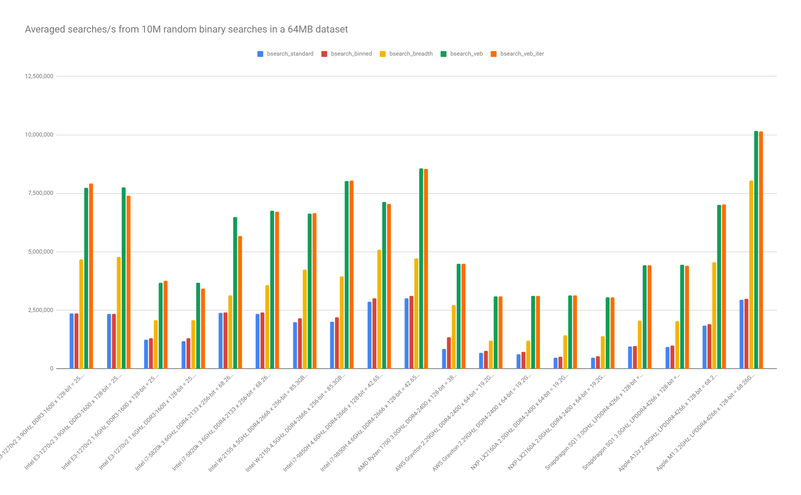

Description
-----------

This project benchmarks several implementations of binary search over a dense array of PODs:

* bsearch_standard - vanilla binary search
* bsearch_binned   - binary search with binning info prepended to the array -- saves first few iterations of the binary search
* bsearch_breadth  - breadth-first (tree-like) layout of the array
* bsearch_veb      - [Van Emde Boas](https://en.wikipedia.org/wiki/Van_Emde_Boas_tree), recursive version
* bsearch_veb_iter - Van Emde Boas, iterative version

How to Build
------------

The build script recognizes these options:

```
$ ./build_test_bsearch.sh 
usage: ./build_test_bsearch.sh { gcc | clang | debug }
```

* gcc   - use the system-default g++ compiler to build a release binary
* clang - use the system-default clang++ compiler to build a release binary
* debug - use the system-default clang++ compiler to build a debug binary

How to benchmark
----------------

The benchmark tool recognizes these options:
```
$ ./test_bsearch --help
usage: ./test_bsearch [space_size <unsigned>] [alt <unsigned>] [<sample_size>]
        alt 0: standard binary search (default)
        alt 1: binned binary search
        alt 2: breadth-first layout binary search
        alt 3: Van Emde Boas (VEB) layout binary search, recursive version
        alt 4: VEB layout binary search, iterative version
        alt 5: standard linear search
        alt 6: binned linear search
```

The POD of the search space is hardcoded to `float` -- to build for another POD change `searchitem_t` in test_bsearch.cpp. The default search-set size (`sample_size`) is set to 10M; the default search-space size (`space_size`) is 2K. To benchmark the performance of standard binary search over a search-space size of 2^24 and a search-set size of 10M do:

```
$ ./test_bsearch space_size $(echo "2^24" | bc) alt 0
```

Warning: don't run any of the linear searches (`alt` 5 & 6) on large seach spaces unless you have unlimited machine time and patience.

Results as graphs
-----------------


